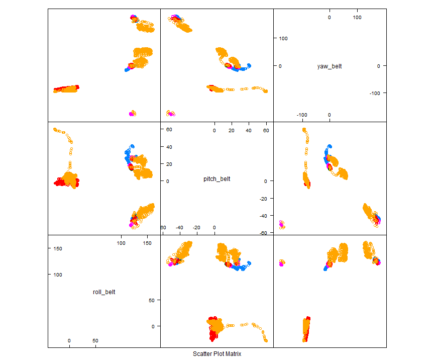
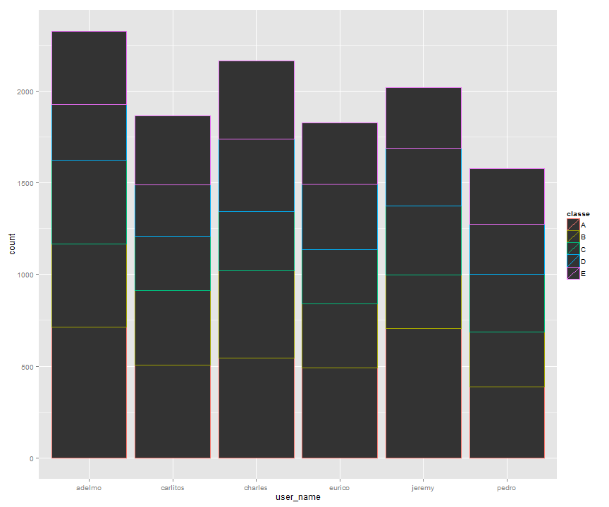
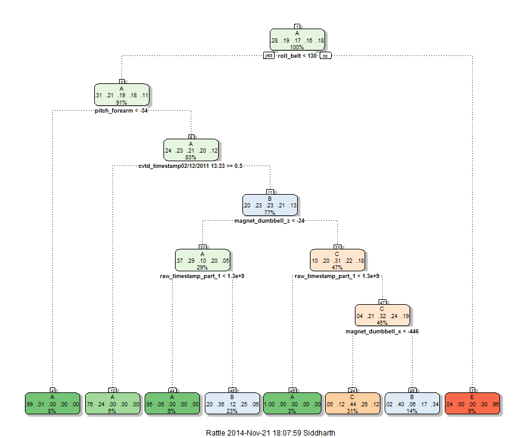
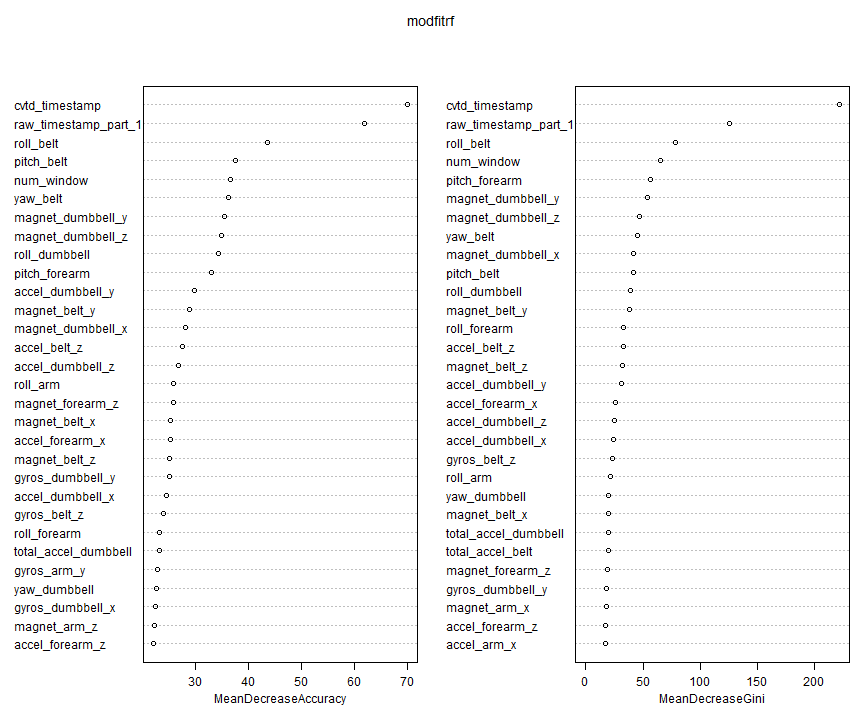

Introduction
---

This study is conducted to predict how well a person performs a health exercise. Devices such as Jawbone Up, Nike FuelBand, and FitBit collect large amount of data about personal activity of a person, which helps predict how well this activity is being performed. We analyze this data by initially cleaning it, and then applying a number of machine learning algorithms in order to create a prediction algorithm that can, once given a test data, predict whether a person is performing an activity properly or not.

Firstly, let us include all the required libraries, read our training data, and assess column characteristics:


```r
library(caret)
library(lattice)
library(rattle)
library(randomForest)
library(knitr)
```


```r
train <- read.csv("pml-training.csv")[,-1] #Read training data
str(train)
```

```
## 'data.frame':	19622 obs. of  159 variables:
##  $ user_name               : Factor w/ 6 levels "adelmo","carlitos",..: 2 2 2 2 2 2 2 2 2 2 ...
##  $ raw_timestamp_part_1    : int  1323084231 1323084231 1323084231 1323084232 1323084232 1323084232 1323084232 1323084232 1323084232 1323084232 ...
##  $ raw_timestamp_part_2    : int  788290 808298 820366 120339 196328 304277 368296 440390 484323 484434 ...
##  $ cvtd_timestamp          : Factor w/ 20 levels "02/12/2011 13:32",..: 9 9 9 9 9 9 9 9 9 9 ...
##  $ new_window              : Factor w/ 2 levels "no","yes": 1 1 1 1 1 1 1 1 1 1 ...
##  $ num_window              : int  11 11 11 12 12 12 12 12 12 12 ...
##  $ roll_belt               : num  1.41 1.41 1.42 1.48 1.48 1.45 1.42 1.42 1.43 1.45 ...
##  $ pitch_belt              : num  8.07 8.07 8.07 8.05 8.07 8.06 8.09 8.13 8.16 8.17 ...
##  $ yaw_belt                : num  -94.4 -94.4 -94.4 -94.4 -94.4 -94.4 -94.4 -94.4 -94.4 -94.4 ...
##  $ total_accel_belt        : int  3 3 3 3 3 3 3 3 3 3 ...
##  $ kurtosis_roll_belt      : Factor w/ 397 levels "","-0.016850",..: 1 1 1 1 1 1 1 1 1 1 ...
##  $ kurtosis_picth_belt     : Factor w/ 317 levels "","-0.021887",..: 1 1 1 1 1 1 1 1 1 1 ...
##  $ kurtosis_yaw_belt       : Factor w/ 2 levels "","#DIV/0!": 1 1 1 1 1 1 1 1 1 1 ...
##  $ skewness_roll_belt      : Factor w/ 395 levels "","-0.003095",..: 1 1 1 1 1 1 1 1 1 1 ...
##  $ skewness_roll_belt.1    : Factor w/ 338 levels "","-0.005928",..: 1 1 1 1 1 1 1 1 1 1 ...
##  $ skewness_yaw_belt       : Factor w/ 2 levels "","#DIV/0!": 1 1 1 1 1 1 1 1 1 1 ...
##  $ max_roll_belt           : num  NA NA NA NA NA NA NA NA NA NA ...
##  $ max_picth_belt          : int  NA NA NA NA NA NA NA NA NA NA ...
##  $ max_yaw_belt            : Factor w/ 68 levels "","-0.1","-0.2",..: 1 1 1 1 1 1 1 1 1 1 ...
##  $ min_roll_belt           : num  NA NA NA NA NA NA NA NA NA NA ...
##  $ min_pitch_belt          : int  NA NA NA NA NA NA NA NA NA NA ...
##  $ min_yaw_belt            : Factor w/ 68 levels "","-0.1","-0.2",..: 1 1 1 1 1 1 1 1 1 1 ...
##  $ amplitude_roll_belt     : num  NA NA NA NA NA NA NA NA NA NA ...
##  $ amplitude_pitch_belt    : int  NA NA NA NA NA NA NA NA NA NA ...
##  $ amplitude_yaw_belt      : Factor w/ 4 levels "","#DIV/0!","0.00",..: 1 1 1 1 1 1 1 1 1 1 ...
##  $ var_total_accel_belt    : num  NA NA NA NA NA NA NA NA NA NA ...
##  $ avg_roll_belt           : num  NA NA NA NA NA NA NA NA NA NA ...
##  $ stddev_roll_belt        : num  NA NA NA NA NA NA NA NA NA NA ...
##  $ var_roll_belt           : num  NA NA NA NA NA NA NA NA NA NA ...
##  $ avg_pitch_belt          : num  NA NA NA NA NA NA NA NA NA NA ...
##  $ stddev_pitch_belt       : num  NA NA NA NA NA NA NA NA NA NA ...
##  $ var_pitch_belt          : num  NA NA NA NA NA NA NA NA NA NA ...
##  $ avg_yaw_belt            : num  NA NA NA NA NA NA NA NA NA NA ...
##  $ stddev_yaw_belt         : num  NA NA NA NA NA NA NA NA NA NA ...
##  $ var_yaw_belt            : num  NA NA NA NA NA NA NA NA NA NA ...
##  $ gyros_belt_x            : num  0 0.02 0 0.02 0.02 0.02 0.02 0.02 0.02 0.03 ...
##  $ gyros_belt_y            : num  0 0 0 0 0.02 0 0 0 0 0 ...
##  $ gyros_belt_z            : num  -0.02 -0.02 -0.02 -0.03 -0.02 -0.02 -0.02 -0.02 -0.02 0 ...
##  $ accel_belt_x            : int  -21 -22 -20 -22 -21 -21 -22 -22 -20 -21 ...
##  $ accel_belt_y            : int  4 4 5 3 2 4 3 4 2 4 ...
##  $ accel_belt_z            : int  22 22 23 21 24 21 21 21 24 22 ...
##  $ magnet_belt_x           : int  -3 -7 -2 -6 -6 0 -4 -2 1 -3 ...
##  $ magnet_belt_y           : int  599 608 600 604 600 603 599 603 602 609 ...
##  $ magnet_belt_z           : int  -313 -311 -305 -310 -302 -312 -311 -313 -312 -308 ...
##  $ roll_arm                : num  -128 -128 -128 -128 -128 -128 -128 -128 -128 -128 ...
##  $ pitch_arm               : num  22.5 22.5 22.5 22.1 22.1 22 21.9 21.8 21.7 21.6 ...
##  $ yaw_arm                 : num  -161 -161 -161 -161 -161 -161 -161 -161 -161 -161 ...
##  $ total_accel_arm         : int  34 34 34 34 34 34 34 34 34 34 ...
##  $ var_accel_arm           : num  NA NA NA NA NA NA NA NA NA NA ...
##  $ avg_roll_arm            : num  NA NA NA NA NA NA NA NA NA NA ...
##  $ stddev_roll_arm         : num  NA NA NA NA NA NA NA NA NA NA ...
##  $ var_roll_arm            : num  NA NA NA NA NA NA NA NA NA NA ...
##  $ avg_pitch_arm           : num  NA NA NA NA NA NA NA NA NA NA ...
##  $ stddev_pitch_arm        : num  NA NA NA NA NA NA NA NA NA NA ...
##  $ var_pitch_arm           : num  NA NA NA NA NA NA NA NA NA NA ...
##  $ avg_yaw_arm             : num  NA NA NA NA NA NA NA NA NA NA ...
##  $ stddev_yaw_arm          : num  NA NA NA NA NA NA NA NA NA NA ...
##  $ var_yaw_arm             : num  NA NA NA NA NA NA NA NA NA NA ...
##  $ gyros_arm_x             : num  0 0.02 0.02 0.02 0 0.02 0 0.02 0.02 0.02 ...
##  $ gyros_arm_y             : num  0 -0.02 -0.02 -0.03 -0.03 -0.03 -0.03 -0.02 -0.03 -0.03 ...
##  $ gyros_arm_z             : num  -0.02 -0.02 -0.02 0.02 0 0 0 0 -0.02 -0.02 ...
##  $ accel_arm_x             : int  -288 -290 -289 -289 -289 -289 -289 -289 -288 -288 ...
##  $ accel_arm_y             : int  109 110 110 111 111 111 111 111 109 110 ...
##  $ accel_arm_z             : int  -123 -125 -126 -123 -123 -122 -125 -124 -122 -124 ...
##  $ magnet_arm_x            : int  -368 -369 -368 -372 -374 -369 -373 -372 -369 -376 ...
##  $ magnet_arm_y            : int  337 337 344 344 337 342 336 338 341 334 ...
##  $ magnet_arm_z            : int  516 513 513 512 506 513 509 510 518 516 ...
##  $ kurtosis_roll_arm       : Factor w/ 330 levels "","-0.02438",..: 1 1 1 1 1 1 1 1 1 1 ...
##  $ kurtosis_picth_arm      : Factor w/ 328 levels "","-0.00484",..: 1 1 1 1 1 1 1 1 1 1 ...
##  $ kurtosis_yaw_arm        : Factor w/ 395 levels "","-0.01548",..: 1 1 1 1 1 1 1 1 1 1 ...
##  $ skewness_roll_arm       : Factor w/ 331 levels "","-0.00051",..: 1 1 1 1 1 1 1 1 1 1 ...
##  $ skewness_pitch_arm      : Factor w/ 328 levels "","-0.00184",..: 1 1 1 1 1 1 1 1 1 1 ...
##  $ skewness_yaw_arm        : Factor w/ 395 levels "","-0.00311",..: 1 1 1 1 1 1 1 1 1 1 ...
##  $ max_roll_arm            : num  NA NA NA NA NA NA NA NA NA NA ...
##  $ max_picth_arm           : num  NA NA NA NA NA NA NA NA NA NA ...
##  $ max_yaw_arm             : int  NA NA NA NA NA NA NA NA NA NA ...
##  $ min_roll_arm            : num  NA NA NA NA NA NA NA NA NA NA ...
##  $ min_pitch_arm           : num  NA NA NA NA NA NA NA NA NA NA ...
##  $ min_yaw_arm             : int  NA NA NA NA NA NA NA NA NA NA ...
##  $ amplitude_roll_arm      : num  NA NA NA NA NA NA NA NA NA NA ...
##  $ amplitude_pitch_arm     : num  NA NA NA NA NA NA NA NA NA NA ...
##  $ amplitude_yaw_arm       : int  NA NA NA NA NA NA NA NA NA NA ...
##  $ roll_dumbbell           : num  13.1 13.1 12.9 13.4 13.4 ...
##  $ pitch_dumbbell          : num  -70.5 -70.6 -70.3 -70.4 -70.4 ...
##  $ yaw_dumbbell            : num  -84.9 -84.7 -85.1 -84.9 -84.9 ...
##  $ kurtosis_roll_dumbbell  : Factor w/ 398 levels "","-0.0035","-0.0073",..: 1 1 1 1 1 1 1 1 1 1 ...
##  $ kurtosis_picth_dumbbell : Factor w/ 401 levels "","-0.0163","-0.0233",..: 1 1 1 1 1 1 1 1 1 1 ...
##  $ kurtosis_yaw_dumbbell   : Factor w/ 2 levels "","#DIV/0!": 1 1 1 1 1 1 1 1 1 1 ...
##  $ skewness_roll_dumbbell  : Factor w/ 401 levels "","-0.0082","-0.0096",..: 1 1 1 1 1 1 1 1 1 1 ...
##  $ skewness_pitch_dumbbell : Factor w/ 402 levels "","-0.0053","-0.0084",..: 1 1 1 1 1 1 1 1 1 1 ...
##  $ skewness_yaw_dumbbell   : Factor w/ 2 levels "","#DIV/0!": 1 1 1 1 1 1 1 1 1 1 ...
##  $ max_roll_dumbbell       : num  NA NA NA NA NA NA NA NA NA NA ...
##  $ max_picth_dumbbell      : num  NA NA NA NA NA NA NA NA NA NA ...
##  $ max_yaw_dumbbell        : Factor w/ 73 levels "","-0.1","-0.2",..: 1 1 1 1 1 1 1 1 1 1 ...
##  $ min_roll_dumbbell       : num  NA NA NA NA NA NA NA NA NA NA ...
##  $ min_pitch_dumbbell      : num  NA NA NA NA NA NA NA NA NA NA ...
##  $ min_yaw_dumbbell        : Factor w/ 73 levels "","-0.1","-0.2",..: 1 1 1 1 1 1 1 1 1 1 ...
##  $ amplitude_roll_dumbbell : num  NA NA NA NA NA NA NA NA NA NA ...
##  $ amplitude_pitch_dumbbell: num  NA NA NA NA NA NA NA NA NA NA ...
##   [list output truncated]
```

The response variable of this data is **classe**, which determines the level of correctness by which an exercise is being performed. Other columns are predictors, which we initially need to clean in order to fit a model.

Data Processing
---

The training data contains **19622** rows and **159** columns. This data set contains a number of columns that are either full of NAs, or empty. Therefore, we clean this data initially by removing these specific columns. 


```r
train <- train[,colSums(is.na(train)) == 0]
nzv <- nearZeroVar(train, saveMetrics = FALSE)
train <- train[,-nzv]
BackupTrainData <- train
```

This has reduced our data set size to **19622** rows and **58** columns.

From our machine learning concepts, it is always advisable to segregate our training data into two parts, namely **train** and **test** data. This **train** data will be used to create a model using one of the many prediction algorithms, and then test this model on our **test** data. The main reason for this is that we get an estimate of our accuracy, and helps in comparing a number of models for this problem statement. This technique is called **cross-validation** We partition our original data as 60-40 (60% training and 40% test data) using these codes:


```r
inTrain <- createDataPartition(y = BackupTrainData$classe, p = 0.6, list = FALSE) #Training 60% and test 40%
test <- train[-inTrain,]
train <- train[inTrain,]
```

Let us plot a few predictors based on **classe** variable to assess any possible relationship between them:


```r
featurePlot(x = train[,c("roll_belt", "pitch_belt", "yaw_belt")], y = train$classe, plot = "pairs")
```

 

```r
qplot(user_name, colour = classe, data = train) #Histogram
```

 

First plot shows a rough cluster formation which segregates each factor in **classe** variable. Second plot (histogram) shows that each user performs each class of activity uniformly.

Now, we will create a few machine learning models using our **train** data and compare them using cross-validation technique on segregated **test** data.

Model Formation
---

As this data set is relatively small, therefore the first model we fit is using **Decision Trees**:


```r
modfitrpart <- train(classe ~ ., method = "rpart", data = train) #Fit the model
fancyRpartPlot(modfitrpart$finalModel) #Print a fancy plot of this tree
```

 

```r
confusionMatrix(test$classe, predict(modfitrpart, newdata = test[-58])) #Confusion matrix to compare predicted vs actual test data.
```

```
## Confusion Matrix and Statistics
## 
##           Reference
## Prediction    A    B    C    D    E
##          A 1695  374  131    0   32
##          B  167 1015  336    0    0
##          C    5  275 1088    0    0
##          D    0  621  665    0    0
##          E    0  449  298    0  695
## 
## Overall Statistics
##                                         
##                Accuracy : 0.573         
##                  95% CI : (0.562, 0.584)
##     No Information Rate : 0.348         
##     P-Value [Acc > NIR] : <2e-16        
##                                         
##                   Kappa : 0.46          
##  Mcnemar's Test P-Value : NA            
## 
## Statistics by Class:
## 
##                      Class: A Class: B Class: C Class: D Class: E
## Sensitivity             0.908    0.371    0.432       NA   0.9560
## Specificity             0.910    0.902    0.947    0.836   0.8951
## Pos Pred Value          0.759    0.669    0.795       NA   0.4820
## Neg Pred Value          0.969    0.728    0.779       NA   0.9950
## Prevalence              0.238    0.348    0.321    0.000   0.0927
## Detection Rate          0.216    0.129    0.139    0.000   0.0886
## Detection Prevalence    0.284    0.193    0.174    0.164   0.1838
## Balanced Accuracy       0.909    0.636    0.690       NA   0.9255
```

Here we see that the accuracy is very poor. Therefore, we try another algorithm to solve this problem.

Next we us **Random Forests** algorithm to fit this training data. As Random Forest creates a number of models (like bagging), this makes our data set to be relatively quite large (11776 rows and 58 columns) in this scenario, making it computationally very slow. Due to this constraint, i tried to fit this model separately, which took a couple of hours to run but resulted in almost 99% accuracy. Therefore, it can be safely said that this model fits perfectly for this data set. For computational purposes, let us partition our original data set as 10-90 and fit a Random Forest model.


```r
inTrain <- createDataPartition(y = BackupTrainData$classe, p = 0.1, list = FALSE) #Training 10% and test 90%
test <- BackupTrainData[-inTrain,]
train <- BackupTrainData[inTrain,]
```

Using randomForest package for training the model:


```r
modfitrf <- randomForest(classe ~ ., data = train, ntree = 1000, keep.forest = TRUE, importance = TRUE)
```

This is a basic summary of our fitted model:


```r
modfitrf
```

```
## 
## Call:
##  randomForest(formula = classe ~ ., data = train, ntree = 1000,      keep.forest = TRUE, importance = TRUE) 
##                Type of random forest: classification
##                      Number of trees: 1000
## No. of variables tried at each split: 7
## 
##         OOB estimate of  error rate: 1.73%
## Confusion matrix:
##     A   B   C   D   E class.error
## A 558   0   0   0   0     0.00000
## B  10 368   2   0   0     0.03158
## C   0  10 332   1   0     0.03207
## D   0   0   8 314   0     0.02484
## E   0   0   0   3 358     0.00831
```

From here, we expect the out-of-bag error to be 2.09%. Now, we validate the accuracy of our model by fitting it on test data:


```r
confusionMatrix(test$classe, predict(modfitrf, newdata = test[-58])) #Printing confusion matrix
```

```
## Confusion Matrix and Statistics
## 
##           Reference
## Prediction    A    B    C    D    E
##          A 5012   10    0    0    0
##          B  144 3264    9    0    0
##          C    0   74 2982   23    0
##          D    0    0   61 2810   23
##          E    0    0   13   49 3184
## 
## Overall Statistics
##                                         
##                Accuracy : 0.977         
##                  95% CI : (0.975, 0.979)
##     No Information Rate : 0.292         
##     P-Value [Acc > NIR] : <2e-16        
##                                         
##                   Kappa : 0.971         
##  Mcnemar's Test P-Value : NA            
## 
## Statistics by Class:
## 
##                      Class: A Class: B Class: C Class: D Class: E
## Sensitivity             0.972    0.975    0.973    0.975    0.993
## Specificity             0.999    0.989    0.993    0.994    0.996
## Pos Pred Value          0.998    0.955    0.968    0.971    0.981
## Neg Pred Value          0.989    0.994    0.994    0.995    0.998
## Prevalence              0.292    0.190    0.174    0.163    0.182
## Detection Rate          0.284    0.185    0.169    0.159    0.180
## Detection Prevalence    0.284    0.194    0.174    0.164    0.184
## Balanced Accuracy       0.986    0.982    0.983    0.985    0.994
```

This results in more than 98% accuracy, which is a pretty good prediction model. The actual out-of-sample error is 1.7%. From the following graph, we can extract the main contributing predictors based on their error rate and its plot:


```r
varImpPlot(modfitrf) #Variable Importance Plot
```

 

This shows that the most important predictors are **cvtd_timestamp**, **raw_timestamp_part_1**, **roll_belt**, **num_window** and **yaw_belt** with the first two being the most important, as they increase accuracy substantially.

Prediction
---

Read an actual test data set for prediction using this model.


```r
TestSet <- read.csv("pml-testing.csv")[,-1]
TestSet <- TestSet[,names(train)[-58]]
rowtrain <- nrow(train)

# Following code creates equal number of levels for cvtd_timestamp factor predictor in 'TestSet' data as that in 'train' data

a <- as.character(c(as.character(train$cvtd_timestamp), as.character(TestSet$cvtd_timestamp)))
a <- as.factor(a)
TestSet$cvtd_timestamp <- a[1965:1984]
```

Predict classe variable in **TestSet** test data and store in individual files for each row:


```r
TestPrediction <- predict(modfitrf, newdata = TestSet)
pml_write_files = function(x){
        n = length(x)
        for(i in 1:n){
                filename = paste0("problem_id_",i,".txt")
                write.table(x[i],file=filename,quote=FALSE,row.names=FALSE,col.names=FALSE)
        }
}
pml_write_files(TestPrediction)
```

The predicted output for this data is:


```r
print(TestPrediction)
```

```
##  1  2  3  4  5  6  7  8  9 10 11 12 13 14 15 16 17 18 19 20 
##  B  A  B  A  A  E  D  B  A  A  B  C  B  A  E  E  A  B  B  B 
## Levels: A B C D E
```
